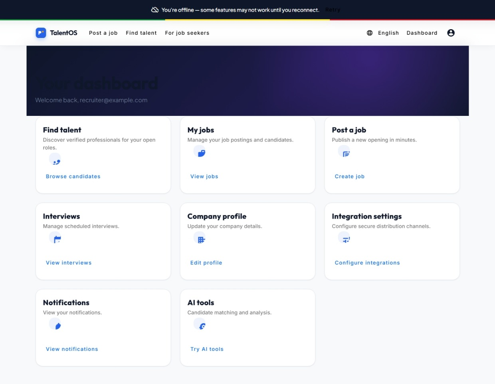

# TalentOS

TalentOS is a full-stack recruitment platform for applicants and recruiters. It combines an ASP.NET Core API with an Angular web application and PostgreSQL persistence.

## Project Status

The core application flow is implemented and the Angular pages are wired to the role-based routes.

### Implemented

- ASP.NET Core 10 backend using Clean Architecture and CQRS with MediatR
- Angular 18 standalone frontend with Angular Material
- JWT authentication with refresh tokens and role-based route guards
- Applicant and recruiter workflows with separate dashboards
- Public job browsing and job detail pages
- Recruiter job creation, editing, publishing, distribution, and application review
- Applicant applications, saved jobs, profile, document management, verification, interviews, and notifications
- Recruiter talent search, talent details, interviews, profile, settings, notifications, and AI tools
- Job, application, interview, document, notification, profile, saved-job, verification, and AI API controllers
- Entity Framework Core with PostgreSQL and OpenAPI documentation through Scalar
- Serilog console and rolling-file logging

### Remaining deployment work

- Configure a real PostgreSQL/Supabase connection for each environment
- Apply and verify EF Core migrations against the target database
- Seed development or demonstration data, if required
- Replace the local file storage, email, and simulated AI services with production providers
- Add a production deployment pipeline and production secrets

## Screenshots

### Applicant experience


### Recruiter experience


### Dashboard



## Architecture

```text
talentos-99-main/
├── angular-app/                    # Angular 18 frontend
│   ├── public/images/              # Frontend image assets
│   └── src/app/
│       ├── core/                   # Layout, i18n, workflow, and shared services
│       ├── guards/                 # Authentication and role guards
│       ├── interceptors/           # JWT and HTTP handling
│       ├── pages/                  # Public, applicant, and recruiter screens
│       ├── services/               # API-facing services
│       └── stores/                 # Client-side application state
├── TalentOS_output/
│   ├── src/TalentOS.Domain/        # Entities, enums, value objects, and contracts
│   ├── src/TalentOS.Application/   # CQRS features, handlers, validators, and DTOs
│   ├── src/TalentOS.Infrastructure/ # EF Core persistence and external services
│   └── src/TalentOS.API/           # Controllers, middleware, and application host
├── MIGRATION_STEPS.md              # Database migration notes
├── SETUP_GUIDE.md                  # Extended setup guidance
└── plan.md                         # Project planning notes
```

## Technology Stack

| Area | Technology |
| --- | --- |
| Backend | ASP.NET Core 10, C# |
| Application architecture | Clean Architecture, CQRS, MediatR |
| Persistence | Entity Framework Core 10, PostgreSQL, Npgsql |
| Frontend | Angular 18, TypeScript, RxJS |
| UI | Angular Material and CDK |
| Authentication | JWT Bearer tokens and BCrypt password hashing |
| Validation and mapping | FluentValidation and Mapster |
| API documentation | OpenAPI and Scalar |
| Logging | Serilog |

## Frontend Routes

Public routes include:

- `/home`
- `/employers`
- `/jobs` and `/jobs/:id`
- `/login` and `/register`

Applicant routes are protected by authentication and the applicant role:

- `/applicant/dashboard`
- `/applicant/applications` and `/applicant/applications/:id`
- `/applicant/saved-jobs`
- `/applicant/profile`
- `/applicant/verification`
- `/applicant/documents`
- `/applicant/interviews`
- `/applicant/notifications`
- `/applicant/ai-tools`

Recruiter routes are protected by authentication and the recruiter role:

- `/recruiter/dashboard`
- `/recruiter/jobs`, `/recruiter/jobs/create`, and `/recruiter/jobs/:id/edit`
- `/recruiter/jobs/:id/distribution`
- `/recruiter/jobs/:id/applications`
- `/recruiter/talent` and `/recruiter/talent/:id`
- `/recruiter/interviews`
- `/recruiter/profile` and `/recruiter/settings`
- `/recruiter/notifications`
- `/recruiter/ai-tools`

## API Surface

The API is organized into the following controller areas:

| Area | Route prefix | Purpose |
| --- | --- | --- |
| Authentication | `/api/auth` | Register, login, refresh, logout, and current user |
| Applicants | `/api/applicants` | Applicant profiles and skills |
| Recruiters | `/api/recruiters` | Recruiter profiles and company information |
| Jobs | `/api/jobs` | Job search, CRUD, publishing, closing, and recruiter jobs |
| Applications | `/api/applications` | Applying, reviewing, updating status, and withdrawing |
| Saved jobs | `/api/savedjobs` | Save and manage applicant job bookmarks |
| Documents | `/api/documents` | Upload, list, and delete applicant documents |
| Verification | `/api/verification` | Submit, review, approve, and reject verification |
| Interviews | `/api/interviews` | Schedule, update, list, and cancel interviews |
| Notifications | `/api/notifications` | Retrieve and mark notifications as read |
| Job distribution | `/api/jobdistributions` | Manage job distribution channels |
| AI tools | `/api/ai` | Resume analysis and candidate matching |
| Health | `/api/health` | Service health check |

Scalar documentation is available at `http://localhost:5269/scalar/v1` when the API is running.

## Prerequisites

- .NET 10 SDK
- Node.js and npm compatible with Angular 18
- PostgreSQL 15 or later, or a Supabase PostgreSQL database
- A configured JWT secret of at least 32 characters

## Getting Started

### 1. Configure the backend

Create or update `TalentOS_output/src/TalentOS.API/appsettings.Development.json` with a development connection string and JWT settings. Keep real credentials out of source control.

```json
{
  "ConnectionStrings": {
    "DefaultConnection": "Host=localhost;Database=TalentOS;Username=postgres;Password=<your_password>"
  },
  "JwtSettings": {
    "Secret": "<a-development-secret-at-least-32-characters>"
  }
}
```

### 2. Restore and build the backend

```powershell
cd TalentOS_output
dotnet restore
dotnet build
```

### 3. Apply database migrations

```powershell
cd TalentOS_output\src\TalentOS.API
dotnet ef database update --project ..\TalentOS.Infrastructure
```

To create a new migration after a schema change:

```powershell
dotnet ef migrations add <MigrationName> --project ..\TalentOS.Infrastructure
```

### 4. Run the API

```powershell
dotnet run --project TalentOS_output\src\TalentOS.API
```

The API listens on `http://localhost:5269` by default. Scalar is available at `http://localhost:5269/scalar/v1`.

### 5. Install and run the Angular application

Open a second terminal:

```powershell
cd angular-app
npm install
npm start
```

The frontend is available at `http://localhost:4200`.

## Testing and Build Commands

Run frontend checks from `angular-app`:

```powershell
npm run build
npm test
```

Run backend checks from the repository root:

```powershell
dotnet build TalentOS_output\TalentOS.sln
dotnet test TalentOS_output\TalentOS.sln
```

## Authentication Flow

1. Register an applicant or recruiter through `/api/auth/register`.
2. Log in through `/api/auth/login` to receive an access token and refresh token.
3. Send the access token as `Authorization: Bearer <token>` for protected requests.
4. Use `/api/auth/refresh` when the access token expires.

The Angular HTTP interceptors handle authenticated API requests and token refresh behavior for the frontend.

## External Service Boundaries

The current implementation includes service boundaries that can be connected to production providers:

- Email delivery service
- Local file storage for uploaded documents
- Simulated AI analysis and candidate matching

See [TalentOS_output/README.md](TalentOS_output/README.md), [SETUP_GUIDE.md](SETUP_GUIDE.md), and [MIGRATION_STEPS.md](MIGRATION_STEPS.md) for backend-specific and database-specific details.

## Security Notes

- Use environment variables, user secrets, or a managed secret store for credentials.
- Replace development JWT secrets before deployment.
- Restrict CORS and enable HTTPS in production.
- Review upload validation and storage permissions before exposing document uploads publicly.
- Do not commit database passwords, access tokens, or production configuration files.
